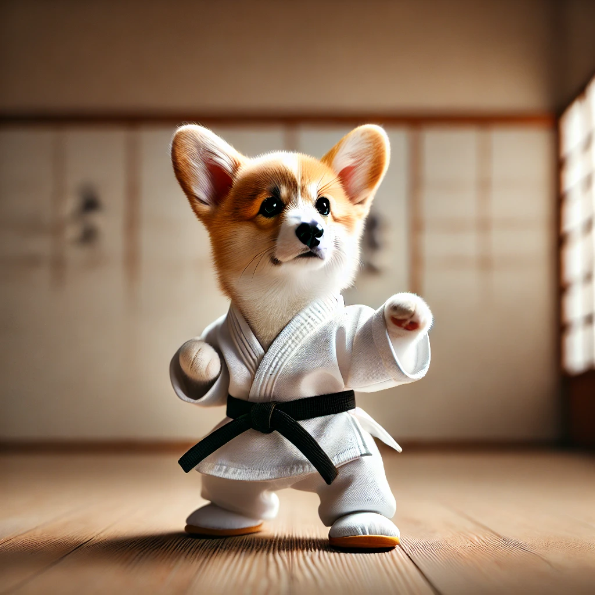
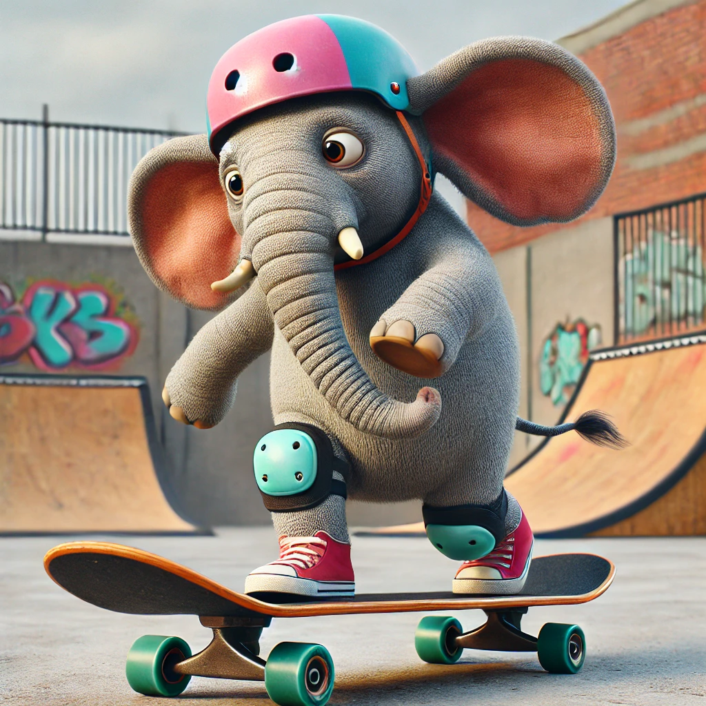
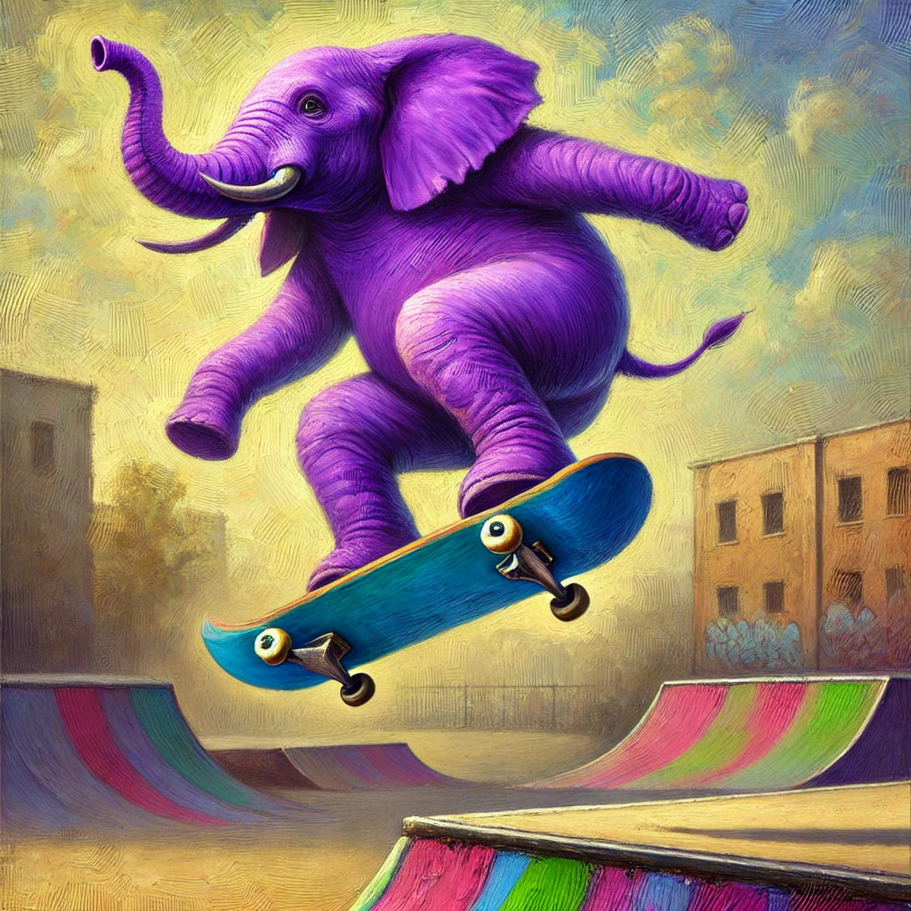
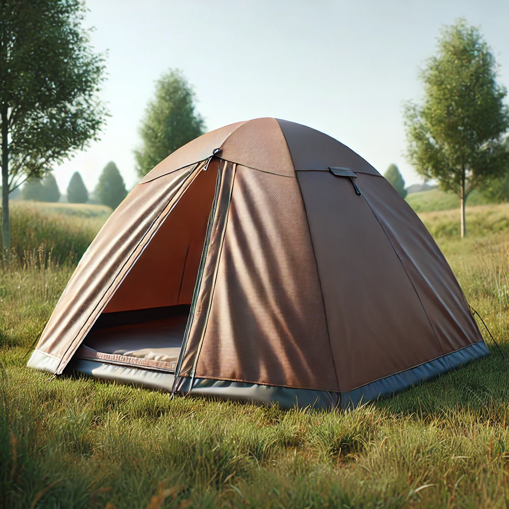
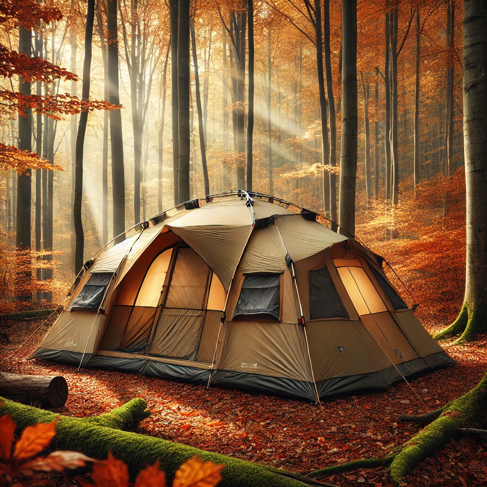
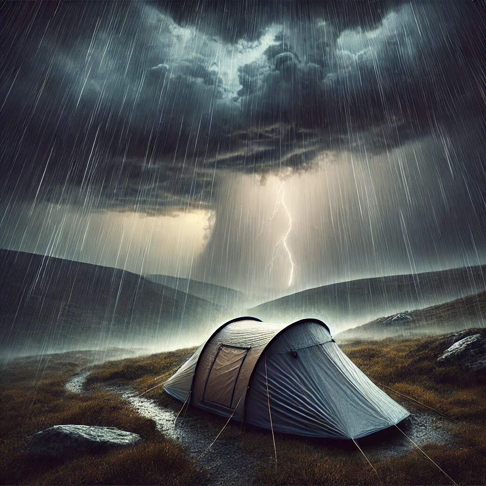
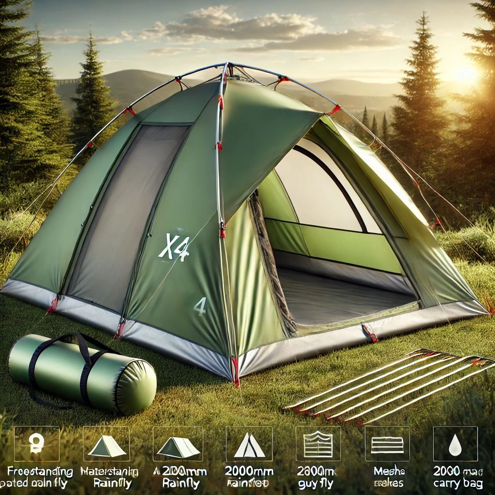

# Part 2 - Image Generation

You can login with: 
roelant@xprtz.cloud 
g6d&6mUX4izRw03%i4f8 

Welcome to part 2 of this workshop, where we will interact with a text-to-image model, DALL-E 3. ChatGPT will figure out you want to generate images from the prompt, and will default to **dall-e-3** for generating images.

## Creating our first images

> What is DALL-E 3? DALL-E 3 is a neural network based model that can generate graphical data from **natural language input**. Put more simply, you can provide DALL-E 3 with a **description** and it can generate an appropriate image.

Let's begin with generating an image by entering a basic prompt in the description box, then clicking on generate:


```A corgi practicing karate```


This will generate something like the following:



Images generated by DALL-E 3 are original; they are not retrieved from a curated image catalog. In other words, DALL-E 3 is not a search system for finding appropriate images - it is an artificial intelligence (AI) model that generates new images based on the data on which it was trained.

### Be specific

Details allow for more accurate responses. Similar to text generation, image generation models greatly benefit from detailed descriptions of what you are looking to generate.

For example, enter the following prompt:


```An elephant on a skateboard```


Execute the prompt and view the image that is generated.

Now, let's modify the prompt by adding more details to the description:


```A purple elephant on a skateboard performing an ollie, in oil painting style```


Execute the prompt once again and compare the results.

 

### Best practices

To create effective and accurate images with DALL-E 3, here are some best practices to follow:

1. **Clear and descriptive prompts**: Craft your text prompts to be clear and detailed. The more specific you are with your description, the more likely DALL-E 3 will generate an image that matches your request. Include attributes such as the subject, action, environment, style, and any important details.

1. **Use of adjectives**: Employ adjectives and adverbs to describe the qualities, emotions, and characteristics you want the image to convey. This helps in refining the generated image to better match your vision.

1. **Balance detail with simplicity**: While details are important, overly complicated or contradictory prompts can confuse the AI, leading to unexpected results. Aim for a balance where your description provides enough context without being overly convoluted.

1. **Experiment with different styles**: Specify artistic styles or influences if you want your image to have a particular aesthetic. For example, you could ask for an image in the style of Van Gogh or futuristic concept art.

1. **Iterative approach**: Often, the first image generated may not be perfect. Use it as a starting point and iteratively refine your prompt based on the output to get closer to your desired result.

1. **Aspect ratio and composition**: If you have a preference for the image’s composition or aspect ratio, include it in your prompt. For example, you might request a landscape-oriented image or a portrait with a subject off-center.

1. **Cultural and contextual references**: If appropriate, include cultural or historical references to provide additional context that can help guide the image generation process.

1. **Ethical considerations**: Be mindful of the ethical implications of your prompts. Avoid creating images that are offensive, perpetuate stereotypes, or infringe on copyrights.

1. **Testing and learning**: Experiment with different prompts to understand how DALL-E 3 interprets various descriptions. This learning process can help you improve the precision of your prompts over time.

1. **Following guidelines**: Adhere to OpenAI's use-case policy and content guidelines when creating prompts. Avoid requesting images that are not allowed as per OpenAI's content policy.

## Website Catalog Creation

For this workshop, we will leverage the capabilities of DALL-E 3 to create a catalog of items for the *Contoso Outdoor Company* e-commerce website.

Let's begin by creating images of tents

>The tents offered are the TrailMaster X4 Tent, the Alpine Explorer Tent and the SkyView 2-Person Tent.

To generate these, try variations of these prompts (get creative and adjust them as you see fit!) If ChatGPT is not generating images, ask it to generate an image using the prompt.:

```A simple brown tent made out of polyester```


```A robust, 8-person tent set up in the middle of an autumn forest```


```A small tent in the middle of a storm```


  

Next, let's try generating backpacks. As before, feel free to adjust and get creative with your prompts!

> The backpacks offered are the Adventurer Pro Backpack, the SummitClimber Backpack and the TrailLite Daypack.


```A compact hiking backpack in vibrant red color```

```A large, 70-liter backpacking pack fully loaded with camping gear```

```A small, realistic lightweight daypack```


Lastly, let's generate images for Hiking clothing.

> The hiking clothing listed as part of the inventory are the Summit Breeze Jacket, the TrailBlaze Hiking Pants and the RainGuard Hiking Jacket.

```A waterproof, breathable rain jacket in bright yellow```

```A pair of rugged, cargo hiking pants in olive green```

```A down-filled, insulated winter jacket in deep blue```

## Advanced Prompting

Now that we have seen some basic prompts, how about we try something new? First, let's clear the chat again by clicking the **New Chat** button.

We are now going to try to generate an Image with the help of the large language model.

1. For this, we will use a thorough description of the product we want to create an Image for:

```
Generate a prompt for DALL-E 3 from this product description:
The TrailMaster X4 Tent by OutdoorLiving offers adventurers a robust shelter for their outdoor excursions. Priced at $250, this polyester tent stands out with its easy-to-follow setup instructions and freestanding design, allowing for effortless relocation. The spacious interior comfortably houses multiple campers and their gear, while the 6-foot peak height ensures ample headroom. Designed to perform in a variety of conditions, the tent comes equipped with water-resistant construction and a 2000mm rated rainfly, ensuring dryness during light rain showers. The mesh panels promote airflow, double as insect protection, and along with the rainfly, provide added weatherproofing.

Beyond its practical features, the TrailMaster X4 Tent is designed with convenience in mind. It features two doors for easy access, interior pockets to help organize small items, and reflective guy lines for increased visibility at night. The tent's 80 square feet of floor area offers enough space for a comfortable camping experience. Additionally, the tent includes aluminum stakes, a gear loft for extra storage, and a carry bag for transport and storage. The green color of the tent blends seamlessly into natural settings, and its robust aluminum poles ensure a stable structure.

The TrailMaster X4 Tent is backed by a 2-year limited warranty and supported by a comprehensive user guide that covers setup, takedown, care, and maintenance, ensuring your investment is well-protected. With its combination of durability, practicality, and comfort, this tent is praised in customer reviews for its spaciousness and weather resistance. Whether you're a weekend warrior or a seasoned camper, the TrailMaster X4 Tent is designed to enhance your outdoor living experience.
```

2. Once you get the response, just copy that message and paste it in the prompting text box and execute the prompt.



3. Now reverse it up by saving the generated image to a location on your hard drive. Let's clear the chat again by clicking the **New Chat** button.
Upload the generated images by using the paper clip upload again, and have it describe what is in the image:

```
Describe what is in the image
```

Congratulations! You have now completed the second part of the lab, and have generated the necessary image assets for the Contoso Outdoors Company e-commerce website. 
